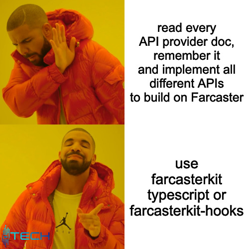

# Farcasterkit

**A unified Typescript API for Farcaster Data**

You need to get Farcaster data and need to read all API documentations and even more. Farcasterkit solves this by offering a one stop library that exposes a unified API so you don't need to worry about different implementations (think viem/ethers.js providers but for Farcaster).

## Installation

```bash
npm install @dtechvision/farcasterkit
```



## Ressources

- [NPM]- TODO
- [React Hooks for FarcasterKit](https://github.com/dtechvision/farcasterkit-hooks)
- [Farcaster Channel] - Whut? wow! use [/fc-devs](https://warpcast.com/~/channel/fc-devs)
- [Docs] - SOON, for now github Issues + Code
- [Looking for Developers? / need Help?] - cast @samuellhuber or any Maintainer on Farcaster for now

## Overview

// soon

## Providers

// documentation soon so far [this](#adding-providers)

## Contributing

If you offer data APIs that you'd wish to be included please refer to [Contributing - Adding Providers](#adding-providers)

### Code

1) Fork the repository: [Click here to fork on Github](https://github.com/dtechvision/farcasterkit/fork)
1) make your contribution and commit it: ```git add . & git commit -a```
1) Push your changes to your fork: ```git push```
1) Open a Pull Request against develop branch: [here on Github](https://github.com/dtechvision/farcasterkit/pulls)
1) Answer to Review Questions and contribute!

### Feedback & Ideas (non devs welcome!)

You're welcome to open [Github Issues](https://github.com/dtechvision/farcasterkit/issues/new) to describe your ideas right here.

### Adding Providers

Have a look at `src/providers/thirdpartyProvider.ts` which is a template for adding new Providers.

Then register your Provider class with a  `nameProvider.ts` file in `src/providers/thirdparty/` with creation of your class.

your file needs to export a Provider that extens the ThirdPartyProvider like the following code sample

```typescript
export class NameProvider extends ThirdParty {
    // add constructor to init your values
    // like an API key etc ...
}
```
